# Project: Agentic AI Tutor (Hackathon Master Plan)

## 1. Context & Objective
We are building a prototype of an **AI Tutoring System** for a Hackathon. The theme is "Agentic AI".
The system acts as an intelligent orchestrator that connects students and professors, managing questions, knowledge retrieval, and learning evolution graphs.

**Key Constraint:** Speed is of the essence. We are following a strict P0 -> P1 -> P2 priority list.

## 2. Tech Stack
* **Package Manager:** uv (Astral) - *Strict requirement for speed.*
* **Language:** Python 3.13
* **API Framework:** FastAPI (thin wrapper over LangGraph)
* **Orchestration/State:** LangGraph (Stateful multi-agent system - **CENTRAL COMPONENT**)
* **Database:** MongoDB Atlas (motor for async) - Object storage and Vector Search
* **Observability:** Phoenix (Arize) for tracing + OpenTelemetry (OTel)
* **Frontend:** React with TypeScript
* **LLM Provider:** Multi-provider abstraction (Google Gemini primary, OpenAI/Anthropic fallback)

## 3. Architecture Overview

### A. High-Level Nodes (The "Brain")
The logic is centralized in the **AI Tutor** (Python/LangGraph), which sits between:
1.  **UI Aluno (Student):** Input source for questions.
2.  **UI Prof (Teacher):** Input source for content/feedback.
3.  **Databases:**
    * *Questões* (Questions Bank)
    * *KDB* (Knowledge Database / Articles)
    * *Grafo evolução* (Knowledge Graph/Progress tracking)
    * *Long Term Insights* (Memory)

```mermaid
flowchart TB
    %% Definitions
    classDef front fill:#b2f0b2,stroke:#333,color:black;
    classDef bd fill:#ffb6c1,stroke:#333,color:black;
    classDef ai fill:#9ecfff,stroke:#333,color:black;

    %% Nodes
    UIAluno(UI Aluno):::front
    UIProf(UI Prof):::front
    AITutor(AI Tutor):::ai

    %% Databases
    Quest(Questões):::bd
    KDB(KDB):::bd
    GrafoTop(Grafo Evolução):::bd
    Msgs(Mensagens):::bd
    LTI(Long Term Insights):::bd

    %% Connections
    UIAluno --> AITutor --> UIProf
    AITutor --> Quest & KDB & GrafoTop
    AITutor --> Msgs & LTI
    UIProf --> GrafoTop
```

### B. Agentic Flow (LangGraph Specification)
The system uses a **Supervisor/Router** pattern.

**Main Graph:**
* **Entry Node:** `Agent` (The Orchestrator)
* **Router:** `Tool Router` decides next step based on user intent.
* **Tools/Nodes:**
    1.  `Planning`: Breaks down complex study requests.
    2.  `ShowQuestions`: Fetches/Displays practice questions.
    3.  `SendMessage`: Chat interaction.
    4.  `WriteToLongTermMemory`: Stores insights (Mocked initially).
    5.  `RouteToRetrievalAgent (questions)`: Handoff to Question Sub-agent.
    6.  `RouteToRetrievalAgent (Articles)`: Handoff to Knowledge Sub-agent.

**Sub-Graphs (Retrieval Specialists):**
* **Question Agent:** Agent -> Tool Router -> `Retrieve(query)` -> Loop back.
* **Knowledge Agent:** Agent -> Tool Router -> `Retrieve(query)` -> Loop back.

## 4. Execution Phases (Strict Priority)

### 🔴 P0 - Macro (Foundation) | Target: 2h
**Goal:** Base system running without specific logic. "Skeleton that compiles."

1.  **Observability Setup:** Configure `Phoenix` and `OTel` instrumentation immediately to trace the graph from step 1.
2.  **Mongo Connection:** Setup `AsyncIOMotorClient` with a robust singleton pattern.
3.  **LLM Provider Abstraction:** Wrap existing `gemini_client.py` with provider interface for swappability.
4.  **Stateful LangGraph Skeleton:**
    * Define the `State` (TypedDict).
    * Create the nodes for the *Main Graph* as placeholders (pass-throughs).
    * Setup the edges and conditional routing.
5.  **FastAPI Wrapper:** Create a single endpoint `/chat` that accepts a payload and runs the graph.
6.  **Tool Calling Base:** Ensure the LLM can successfully call a dummy tool.

### 🟡 P1 - Integrar (Integration) | Target: 1.5h
**Goal:** Connect the modules. Real data flow.

1.  **Retrieval Modules:**
    * Implement `Retrieve(query)` using MongoDB Vector Search.
    * Connect `Question Agent` and `Knowledge Agent` sub-graphs.
2.  **Routing Logic:** Implement system prompts allowing `Tool Router` to distinguish "I need a question" vs "I need to study".
3.  **Front-End Integration:** Connect React UI to the FastAPI `/chat` endpoint via WebSocket.
4.  **Memory:** Implement `WriteToLongTermMemory` as a simple Mongo insert.

### 🟢 P2 - Case (Refinement) | Target: 1.5h
**Goal:** Make it demo-ready.

1.  **Mocks do Tema:** Hardcode specific "Happy Paths" (e.g., specific Physics/Coding topic).
2.  **Language Check:** Ensure all System Prompts force **Portuguese (PT-BR)** responses.
3.  **Planning Node:** Implement basic logic for `Planning` (e.g., generate 3-step study plan).
4.  **Refinement:** Polish UI, reduce latency, add "Thinking..." indicators.

## 5. Mocking Strategy
* **Long Term Insights:** Save conversation summary to a list (no complex RAG).
* **Grafo Evolução:** Output a static JSON structure the frontend renders; do not calculate weights.
* **Authentication:** Hardcode `user_id="hackathon_judge"`.

## 6. Development Guidelines
* **Dependency Management:** Use `uv add <package>` for all installs. Do not use pip directly.
* **No Hallucinations:** Do not import packages we haven't installed.
* **Type Safety:** Use Pydantic models for all Tool inputs/outputs.
* **Tracing:** Every agent node must be traceable in Phoenix.
* **LangGraph-Centric:** FastAPI is a thin wrapper. All logic lives in LangGraph workflows.
* **Async First:** All database and LLM operations must be async (use motor, not pymongo).

## 7. Current Project Status

### ✅ Implemented
- **Directory Structure:** Restructured from `app/` to `src/`
- **Gemini LLM Client:** Production-ready async client with retry, circuit breaker, caching
- **MongoDB I/O:** Basic synchronous connection utilities (needs motor migration)
- **FastAPI Scaffold:** Health endpoints, basic routing

### 🚧 In Progress
*See IMPLEMENTATION_PLAN.md for detailed task breakdown*

### 🔴 Critical Gaps
- LangGraph integration (graphs, nodes, state management)
- Observability (Phoenix + OpenTelemetry)
- Async MongoDB migration (pymongo → motor)
- LLM provider abstraction layer
- Vector search implementation
- React frontend
- `/chat` endpoint with graph invocation
